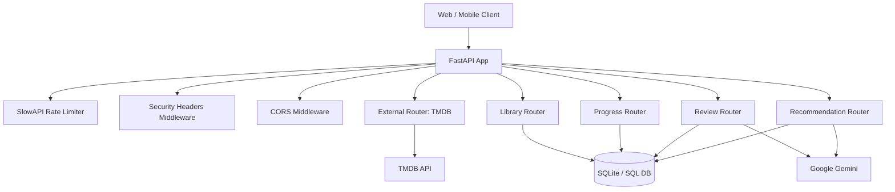

# MovieMate-BE

Production-ready backend service for managing a personal movie/TV library with progress tracking, reviews, and AI-assisted recommendations.

Built with FastAPI, SQLAlchemy, and external integrations (TMDB + Gemini), this service exposes a versioned REST API and applies operational safeguards such as rate limiting, security headers, and structured pagination.

## Table of Contents

- Overview
- Key Features
- System Architecture
- Request Workflow and Core Logic
- API Endpoints
- Data Model
- Configuration
- Local Development
- Running in Production
- Error Handling and Reliability
- Security Posture
- Known Gaps and Recommended Improvements
- Project Structure

## Overview

MovieMate-BE provides:

- Library management for movies and TV shows.
- Watch-progress tracking with media-type-aware validation.
- Review creation and review listing with sentiment summary.
- Recommendation generation from user library preferences.
- External metadata and search powered by TMDB.

The API is versioned (`/api/v1`) and supports common platform concerns:

- CORS controls.
- Rate limiting with route-specific policies.
- Security response headers.
- Consistent pagination payloads and metadata.

## Key Features

- **Library ingestion**
  - Add titles from TMDB identifiers.
  - Enforces uniqueness by `(tmdb_id, media_type)`.
  - Auto-creates initial progress state (`not_started`).

- **Library retrieval and filtering**
  - Paginated library listing.
  - Filtering by genre, platform, and watch status.
  - Sorting by date added, title, or average rating.

- **Progress management**
  - Strict validation for movie vs TV progress semantics.
  - Prevents invalid episode counts and overflow conditions.

- **Review system**
  - Add ratings/comments against existing library items.
  - Paginated review retrieval.
  - Gemini-based summary of returned review comments.

- **Recommendations engine**
  - Sends normalized library profile (including avg ratings) to Gemini.
  - Returns structured recommendation objects with rationale.

- **TMDB integration**
  - Multi-search endpoint for movies/TV.
  - Detail endpoint with media-type auto-detection fallback.

## System Architecture



### Technical Stack

- **Framework**: FastAPI
- **ASGI server**: Uvicorn
- **ORM**: SQLAlchemy 2.x style mappings
- **Validation/config**: Pydantic + pydantic-settings
- **HTTP client**: httpx (async)
- **Rate limiting**: slowapi
- **AI integration**: `google-generativeai`
- **Database (default)**: SQLite

## Request Workflow and Core Logic

### 1. Application bootstrap

At startup:

1. Settings are loaded from environment (`.env`).
2. FastAPI app is created with app/version metadata.
3. Rate limiter is attached and global 429 handler is configured.
4. Middleware is registered (rate-limit, security headers, CORS).
5. API routers are mounted at `/api/{version}`.
6. SQLAlchemy metadata creates tables on startup.

### 2. Request lifecycle

For each request:

1. Request passes through SlowAPI middleware for per-route throttling.
2. Route handler validates path/query/body with Pydantic schemas.
3. Business logic executes:
   - DB queries/transactions and/or external API calls.
   - Domain rules are enforced (e.g., episode constraints).
4. Response is returned with standard headers:
   - `X-API-Version`
   - `X-Total-Count` (for paginated list endpoints)
   - `Retry-After` (on rate limit exceed)

### 3. Core business rules

- Library item uniqueness is guaranteed for TMDB ID + media type.
- Every library item has one progress record (`Progress.item_id` unique).
- Movie progress cannot include episode fields.
- TV progress must include both episode fields and respect bounds.
- Review rating is constrained to `[1,5]`.

## API Endpoints

Base prefix (default): `http://localhost:8000/api/v1`

### Health and discovery

- `GET /health`
  - Service health probe.
- `GET /api`
  - Returns supported API versions.

### TMDB

- `GET /api/v1/search`
  - Query params: `query`, `page`, `page_size`
  - Returns normalized movie/TV search results.
- `GET /api/v1/details/{tmdb_id}`
  - Query params: optional `media_type` (`movie` or `tv`)
  - Auto-detects media type when omitted.

### Library

- `POST /api/v1/library/add`
  - Adds an item and initializes progress.
- `GET /api/v1/library`
  - Paginated library list with status + average rating.
- `GET /api/v1/library/filter`
  - Filter by `genre`, `platform`, `status`.
  - Sort by `rating|title|date_added` and `asc|desc`.

### Progress

- `PUT /api/v1/progress/{item_id}`
  - Upsert-like behavior for progress.
  - Enforces media-specific constraints.
- `GET /api/v1/progress/{item_id}`
  - Fetches progress for a library item.

### Reviews

- `POST /api/v1/review`
  - Creates a review for an item already in library.
- `GET /api/v1/reviews/{movie_id}`
  - Returns paginated reviews + AI summary.

### Recommendations

- `GET /api/v1/recommended`
  - Query param: `max_recommendations` (1-20)
  - Returns AI-generated recommendations.

## Data Model

### `movie_shows`

- `id` (PK)
- `tmdb_id` (indexed)
- `title`
- `media_type` (`movie` | `tv`)
- `genre`
- `platform`
- `date_added`

Constraints/indexes:

- Unique: `(tmdb_id, media_type)`
- Indexes on title, genre, platform, date_added

### `progress`

- `id` (PK)
- `item_id` (FK -> `movie_shows.id`, unique)
- `total_episodes` (nullable)
- `watched_episodes` (nullable)
- `status` (`not_started` | `watching` | `completed`)

Constraint:

- Episode fields must be both null or both non-null and valid (`watched <= total`).

### `reviews`

- `id` (PK)
- `item_id` (FK -> `movie_shows.id`)
- `rating` (1..5)
- `comment`
- `created_at`

Indexes:

- `item_id`, `rating`, `created_at`

## Configuration

Set values in `.env` (or environment variables):

- `APP_NAME`, `APP_VERSION`, `ENVIRONMENT`, `DEBUG`
- `API_PREFIX`, `API_VERSION`
- `DATABASE_URL`
- `TMDB_API_KEY`, `TMDB_BASE_URL`, `TMDB_IMAGE_BASE_URL`
- `GEMINI_API_KEY`
- `CORS_ORIGINS`
- `DEFAULT_PAGE_SIZE`, `MAX_PAGE_SIZE`
- `DEFAULT_RATE_LIMIT`, `SEARCH_RATE_LIMIT`, `DETAIL_RATE_LIMIT`

Notes:

- `CORS_ORIGINS` supports JSON array or comma-separated values.
- `API_PREFIX` and `API_VERSION` are normalized and validated on startup.

## Local Development

### 1. Install dependencies

```bash
pip install -r requirements.txt
```

### 2. Configure environment

```bash
copy .env.example .env
```

Update `.env` with valid keys, especially:

- `TMDB_API_KEY`
- `GEMINI_API_KEY`

### 3. Run API

```bash
uvicorn app.main:app --reload --host 0.0.0.0 --port 8000
```

### 4. Verify service

- Health check: `GET http://localhost:8000/health`
- OpenAPI docs: `http://localhost:8000/docs`

## Running in Production

Recommended deployment baseline:

- Use a managed SQL database (PostgreSQL/MySQL) instead of SQLite.
- Run with multiple workers behind a reverse proxy.
- Terminate TLS at ingress/load balancer.
- Keep secrets in secret manager (not `.env` files in deployments).
- Add structured logging and centralized observability.
- Add CI gates for linting, tests, and security scanning.

Example production command:

```bash
uvicorn app.main:app --host 0.0.0.0 --port 8000 --workers 4
```

## Error Handling and Reliability

- Consistent HTTP errors via `HTTPException`.
- Rate-limit breaches return `429` with `Retry-After` header.
- TMDB upstream failures map to client-safe responses:
  - `404` passthrough for not found.
  - `502` for upstream availability/server issues.
- Database session lifecycle is managed per-request.

## Security Posture

Security headers added to every response:

- `X-Content-Type-Options: nosniff`
- `X-Frame-Options: DENY`
- `Referrer-Policy: strict-origin-when-cross-origin`
- `X-XSS-Protection: 1; mode=block`
- `Cache-Control: no-store`
- `X-API-Version: <version>`

Additional controls:

- CORS allowlist support.
- Input validation through typed schemas and bounded fields.
- Rate limits to reduce abuse and protect upstream providers.

## Known Gaps and Recommended Improvements

To harden this service for enterprise production:

1. Add automated tests (unit + integration + contract tests).
2. Introduce DB migrations (Alembic) instead of startup `create_all`.
3. Add authentication/authorization (JWT or OAuth2).
4. Add request/response structured logging and trace IDs.
5. Add retry/backoff and circuit-breaker strategy for AI/TMDB clients.
6. Add caching for TMDB details/search responses where appropriate.
7. Add stricter data normalization for `genre` and `platform` fields.
8. Add explicit timeout and failure fallback behavior for Gemini routes.
9. Consider asynchronous task queue for AI-heavy operations.
10. Add Dockerfile + compose/Kubernetes manifests.

## Project Structure

```text
MovieMate-BE/
  app/
    api/
      router.py
      v1/router.py
      routers/
        external.py
        library.py
        progress.py
        review.py
        recommended.py
    core/
      config.py
      rate_limit.py
    db/
      base.py
      session.py
    middleware/
      security.py
    models/
      models.py
    schemas/
      common.py
      library.py
      progress.py
      review.py
      recommended.py
      tmdb.py
    services/
      tmdb_service.py
      gemini_service.py
    main.py
  requirements.txt
  .env.example
```